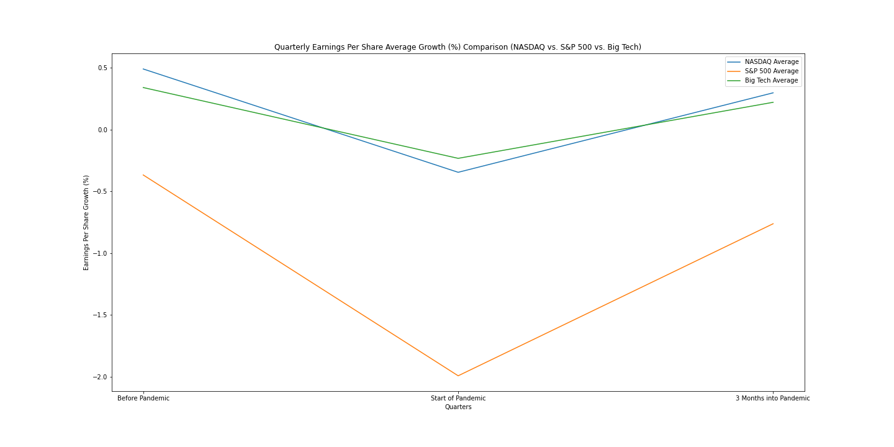
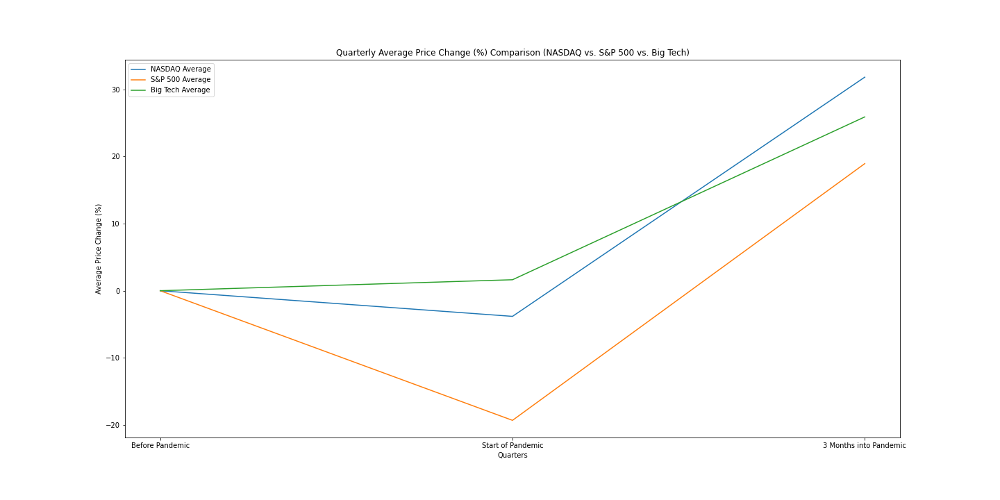
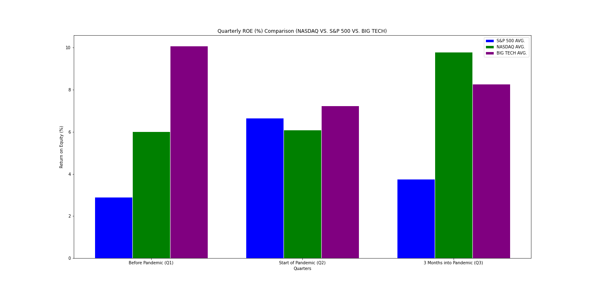
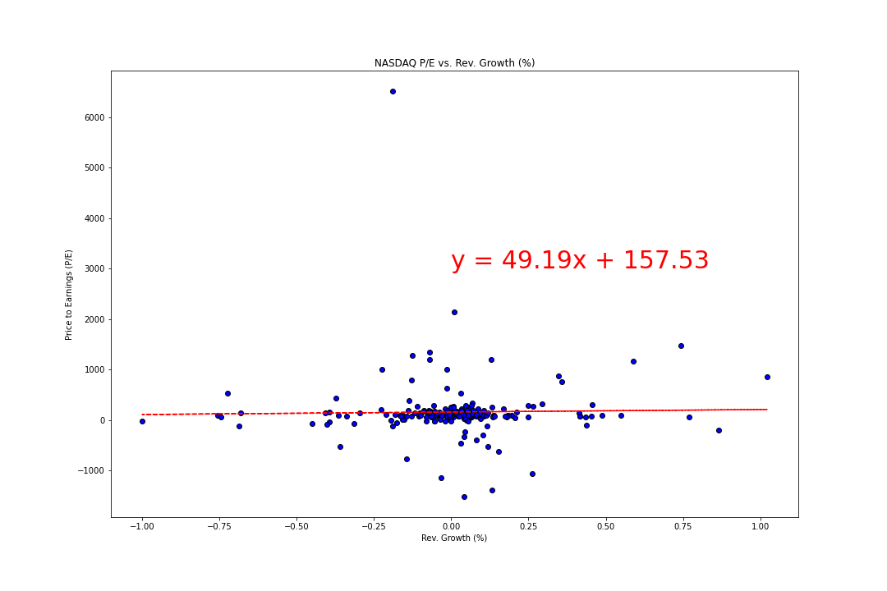

# UCI-Project-1-Team-4

As the economy shut down and the virus spread across the country, the DOW Jones and S&P benchmark experienced the fastest ever fall after hitting record-highs in February. Since then, however, U.S. stocks have been on a winning streak that is unprecedented in the modern era of financial markets. We utilized the Financial Modeling Prep API to analyze the stark gap between the growth outlook for growth companies (75% of stock market) and that of pedestrian companies (25% of stock market). Specifically, we analyzed price changes (Year-to-Date) as well as key financial metrics and ratios per sector. Our objective was to retrieve data to conclude which sectors performed better, worse, and compare how quickly they were able to rebound from the losses suffered during the start of the pandemic. Ultimately, this analysis' aim was to prove that the stock market is a reflection of investors’ future expectations as opposed to true valuation based on current income and intrinsic value. 

# Research Questions:

1. How did each sector perform leading up to and during the pandemic? Which sectors did worse? Better?
2. How did they perform...
  - ...relative to the S&P 500 index? 
  - ...relative to the NASDAQ index? 
3. Do industry average P/E ratios align with revenue growth and current income? 
4. Finally, is this a bubble?

# Hypotheses

Null Hypothesis:
  - The effect of COVID-19 on the tech sector of the stock market is justified by a strong correlation between the Price to Earnings Ratio and the Revenue Growth Rate of companies in the NASDAQ.

Alternative Hypothesis:
  - Specific technology companies (excluding Big Tech) have failed to prove that high-growth and high profitability go hand-in-hand. 
  - A majority of technology companies did not deliver on earnings that validated the inflation in their prices (Favors chances of there being a tech bubble)

# Data Cleanup and Exploration

We first gathered quarterly data for every company in both the NASDAQ, which is primarily made up of tech companies, and the S&P 500 on each of the following at three important benchmarks for our analyses: 

  - P/E - Price to earnings ratio. The higher the ratio, the higher a company is valued beyond returns, which could signal inflated value. 
  - ROE - Return on Equity. The higher the return, the more justification for a company's value. 
  - Operating Income Growth - The higher the income, the more a company's high market value can be justified.
  - Revenue Growth - We used this metric to measure company growth at several stages before and during the pandemic.
  - EPS - Earnings per share. A higher earnings per share generally signals justification for a company's high market value.
  - Historical Daily Prices - This was used as a direct measure of market value along the different stages of the pandemic.
  
  First, was data from three months before the pandemic as a control. Next was at the start of the pandemic to gauge the effect that the pandemic initially had on both tech companies and S&P 500 constituents at the time. Finally, we collected data on constituents three months after the start of the pandemic to make a fair comparison between the recovery of tech companies and the biggest blue chip stocks in the United States.

After the data collection was time for cleanup. Using a Jupyter Notebook file, we joined the S&P 500 data from all three timestamps into one dataframe, dropping empty cells and removing duplicate rows and rows with null values. 

# Data Visualization and Qualitative Assertions

Using the cleaned data, we used Matplotlib to create visualizations that we could then derive qualitative assertions from.

This bar graph shows the average Operating Income Growth for the different sectors that made up the S&P 500 constituents during the three months after the pandemic. We can clearly see that the info tech sector suffered the second largest losses in growth after the energy sector, yet stock prices in the NASDAQ soared. This suggests that companies in tech are able to grow without incremental investments (they don’t require much in the way of factories or working capital to make their products).

For the next graphs, we drew comparisons not only between the NASDAQ and the S&P 500, but also took it a step further and chose to graph data from Big Tech companies (Facebook, Amazon, Apple, Netlix, and Google). 

The Earnings Per Share Growth for both the technology sector and the overall market saw a falloff at the start of the pandemic, but while the technology sector saw a bounceback into positive earnings per share growth, the combined average of the overall market saw an even steeper decline. This disparity in earnings per share growth shows that the tech sector has a higher resilience than the overall market, and this can clearly be explained. The adoption of technology was clearly pulled forward by the pandemic, as cloud computing and ecommerce became more and more commonplace for everyday consumption in businesses, schools, and homes. 

The NASDAQ index (composed of technology stocks) rebounded faster than the S&P 500 index in operating income growth and maintained steady growth levels. The overall market, on the other hand, still suffered losses and returned to pre-pandemic levels.

At the start of the pandemic, the S&P 500, which is represented by this orange line and representative of the overall market, saw a steep average price decline and a big jump in its Return On Equity (or ROE) that same quarter. This could mean that while the overall market saw a decrease in shareholder equity, it raked in a net income comparable to before the pandemic. 

More importantly, 3 months into the pandemic, we can see that the ROE of the overall market saw a steep decline, and the average price jumped up considerably. This means that while shareholder confidence in the overall market jumped up, the overall net income did not follow suit. 

The ROE of the overall tech sector increased during the pandemic, along with a huge increase in its price, which means that the increase in net income of the tech sector actually excelled past shareholder expectations, which again shows the resilience and strength of the tech sector’s ability to bring profitability. 

# Quantitative Analysis

For our quantitative Analysis, we tested our hypothesis by testing the correlation between the Price to Earnings Ratio and the Revenue Growth Rate of all NASDAQ companies. Ultimately what we were doing with this regression correlation was testing the relationship between the expectations of the stockholders and the actual performance of the companies in the tech sector. 

We accomplished this by creating a scatter plot and plotting a regression line that would test the strength of these two metrics in the context of the pandemic. We then pulled the correlation coefficient. 
That r-value for the correlation between Price/Earnings ratio and Revenue Growth for the tech sector was approximately 0.02077, which indicates a very weak relationship. This means that we can reject our null hypothesis, and that the high confidence of investors in the tech sector cannot be justified by the revenues that the tech sector is bringing in.
Now, this quantitative analysis does not for a fact say that tech stocks are overvalued, because the reason the tech sector is priced so highly could be attributed to a high valuation for future advancements, but it does support this idea that the tech sector of the stock market is in a bubble. 

# Conclusion and Limitations

From both the qualitative and quantitative analyses, our findings show that the average figures in terms of growth, valuation, and performance are not significant enough to support conclusions about the stock market. Although our visualizations and assertions do support our hypothesis that we are in a tech bubble, there are limitations that we have not analysed that may impact our conclusion, including but not limited to the following:

  - Lack of macroeconomic factors such as interest rates, unemployment rates, and per capita disposable income
  - API data is not the most recent, ends at Q2 (June 30, 2020) Since we only analyse up to to the last quarter, the most recent market data was not included in our analysis
  - Markets are impacted by qualitative factors, so valuation and profitability metrics are not enough to draw large conclusions 

# Datasources
Financial Modeling Prep API: https://financialmodelingprep.com/developer/docs/#Market-Capitalization
  - Financial Ratios (priceEarningsRatio, returnOnEquity): https://financialmodelingprep.com/developer/docs/#Company-Financial-Ratios
  - Financial Growth (operatingIncomeGrowth, epsgrowth, revenueGrowth): https://financialmodelingprep.com/developer/docs/#Company-Financial-Statements
  - Historical Daily Prices - closing price (2020-06-27, 2020-03-28, 2019-12-28): https://financialmodelingprep.com/developer/docs/#Historical-stock-index-prices
  - Historical Stock Splits: https://financialmodelingprep.com/developer/docs/#Historical-Stock-Splits

